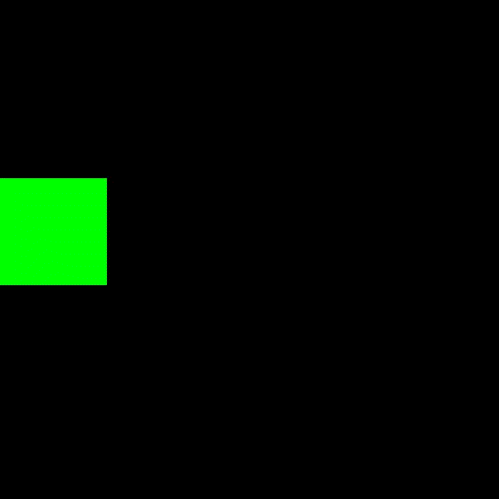
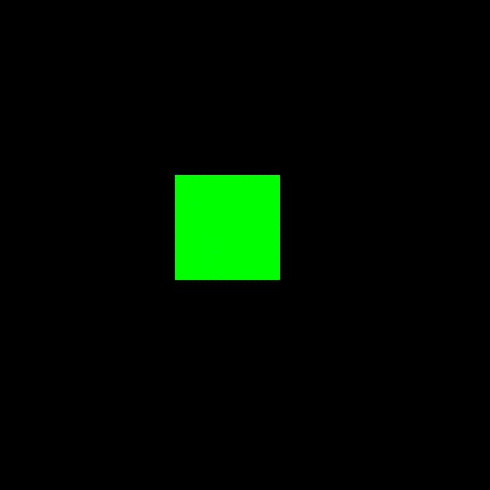

# Pygame Animations
This code allows you to add smooth movement and scaling to pygame surfaces.
Mostly all the animation types require a duration (in seconds) and a function (if you dont want to use the default function).
 


## Requirements
python3

pygame 1.9.5

easings.py
## Floating Animation (Float)
This animation runs indefinitely and adds a floating effect to the surface.

#### Arguments :
- `__init__(surface_rectangle , magnitude , axis , duration , function = inOutCubic)`

- `magnitude` is the number of pixels the surface travels on the screen.

- `axis` is either `"x"` or `"y"`.

- `duration` is always in seconds. Its the time taken to complete once cycle.

- `function` is the easing-function imported from easings.py and set to default as `inOutCubic`

---
`Float.start_float()` 

- It returns a new value according to the `axis` passed and it must assigned to `surface_rect.x` or `surface_rect.y` in the main pygame loop.
#### Example

```python
import pygame
from Animations import Float
import sys

pygame.init()

Screen = pygame.display.set_mode((700, 700))
fps = pygame.time.Clock()
frames = 60


surface = pygame.Surface((150, 150))
surface_rect = surface.get_rect(x=0, y=250)
surface.fill(pygame.Color("green"))

surface_floater = Float(surface_rect, 550, "x", 3)
time_list = [surface_floater]

while True:
    Screen.fill(pygame.Color("black"))
    for event in pygame.event.get():
        if event.type == pygame.QUIT:
            pygame.quit()
            sys.exit()

    for element in time_list:
        element.time += 1 / frames

    surface_rect.x = surface_floater.start_float()
    Screen.blit(surface, surface_rect)

    pygame.display.update()

    fps.tick(frames)
```


## Smooth Movement (Move)

This animation moves the surface to a desired position.
#### Arguments:

- `__init__(surface_rectangle , duration , function = inOutCubic)`

- `duration` is the time taken to move the surface from its old position to the `new_position`.

- `function` is the easing-function imported from easings.py and set to default as `inOutCubic`.  

---
`Move.moveto(new_position)`
- `new_position` must be a list having `[new_xpos , new_ypos]` 
Also the function must be called inside the main loop


#### Example
```python3
import pygame
from Animations import Move
import sys

pygame.init()

Screen = pygame.display.set_mode((700, 700))
fps = pygame.time.Clock()
frames = 60

surface = pygame.Surface((150, 150))
surface_rect = surface.get_rect(x=250, y=250)
surface.fill(pygame.Color("green"))

surface_mover = Move(surface_rect, 5)
time_list = [surface_mover]

while True:
    Screen.fill(pygame.Color("black"))
    for event in pygame.event.get():
        if event.type == pygame.QUIT:
            pygame.quit()
            sys.exit()

    for element in time_list:
        element.time += 1 / frames

    surface_mover.moveto([500, 250])
    Screen.blit(surface, surface_rect)

    pygame.display.update()
    fps.tick(frames)
```

## Smooth Scale (SmoothScale)
This animation scales the surface to a new `[height , width]`.
It can be more or less than the original size.

#### Arguments
- `__init__(surface , new_size , duration , function = inOutCubic)`

- `new_size` must be a list/tuple having new `height , width` 

- `duration` is the time taken to scale the the surface to its `new_size`

- `function` is the easing-function imported from easings.py and set to default as `inOutCubic`.

---
`SmoothScale.give_surface()`
- It must be called in the main loop.
- It returns a new surface with `new_size`

---
#### Example
```python
import pygame
from Animations import SmoothScale
import sys

pygame.init()

Screen = pygame.display.set_mode((700, 700))
fps = pygame.time.Clock()
frames = 60

surface = pygame.Surface((150, 150))
surface_rect = surface.get_rect(x=250, y=250)
surface.fill(pygame.Color("green"))

surface_scaler = SmoothScale(surface, [300, 300], 5)
time_list = [surface_scaler]
while True:
    Screen.fill(pygame.Color("black"))
    for event in pygame.event.get():
        if event.type == pygame.QUIT:
            pygame.quit()
            sys.exit()

    for element in time_list:
        element.time += 1 / frames

    surface = surface_scaler.give_surface()
    Screen.blit(surface, surface_rect)

    pygame.display.update()
    fps.tick(frames)
```

